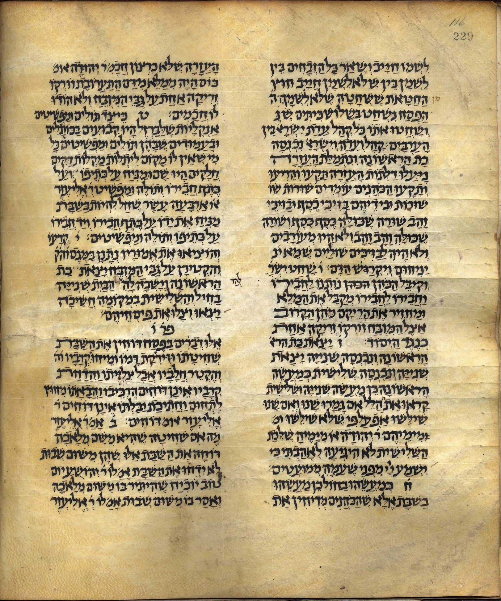
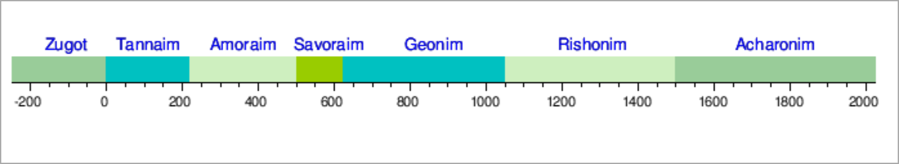
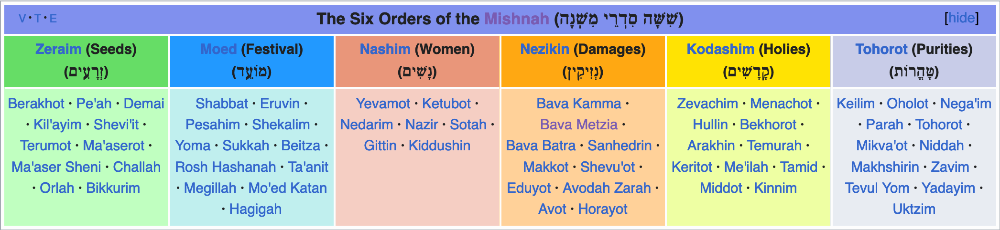
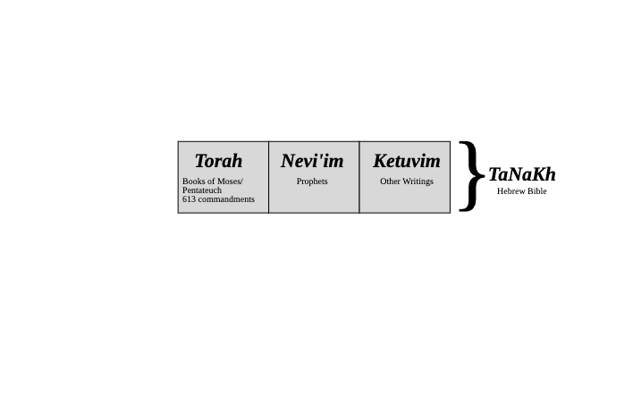
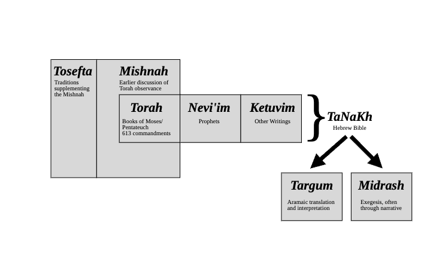
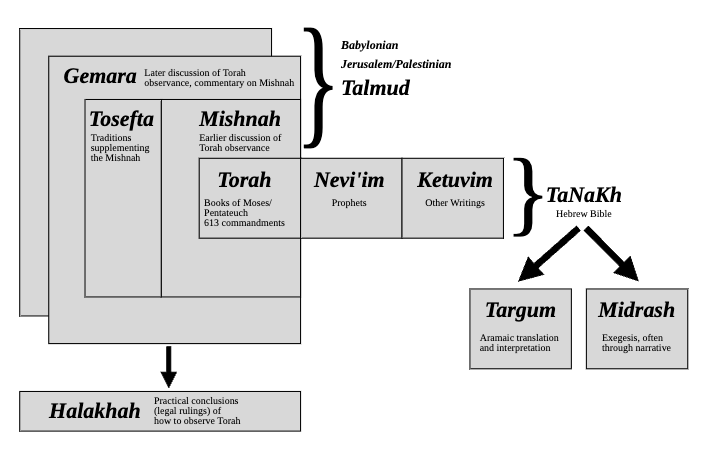

# Einführung ins Judentum
{: .r-fit-text}

### Wie werden die heiligen Schriften ausgelegt (und von wem)?

Sommersemester 2025
Prof. Dr. Nathan Gibson

## 📈 Rückblick: Besuch Synagoge

- Was war für dich neu? (Wer war das erste Mal in einer Synagoge?)
- Was hat dich überrascht? 
- Was war für dich verwirrend?

## Projekte

- Pesach
- Schawuot

## Einleitung

Rabbinisches Judentum ist "rabbinisch", weil ...

## Einleitung: Mündlichkeit

- bei Rot stehen, bei Grün gehen
- rechts vor links
- Reißverschlussverfahren
- "halber Tacho" (halben Tachowert Abstand halten)

## Heutiges Lernziel

Einige jüdische sakrale Texte aufzählen und ihr Zusammenspiel mit mündlichen Praktiken erläutern.

## Lektüre

- Solomon
- [YouTube Video](https://www.youtube-nocookie.com/embed/nBeDU09o9Hw?cc_load_policy=1&cc_lang_pref=de)

## Mischna

Tool: <https://Sefaria.org>

## What is the Mishnah?

<figcaption>
Source: https://archive.org/details/Mishnah_Kaufman_ms, Public Domain.
</figcaption>

## Mishnah with other rabbinic texts

<figcaption>
Source: https://en.wikipedia.org/wiki/Tannaim, CC BY SA 3.0.
</figcaption>

## Organization of the Mishnah

<figcaption>
Source: https://en.wikipedia.org/wiki/Talmud, CC BY SA 3.0.
</figcaption>

## Talmud usw.

 

## Talmud usw.

 

## Talmud usw.

## Midrasch

## Diskussion

<!-- Skit from Talmud passage -->

- Rolle der Mündlichkeit
  - Wer ist der Autor? 
  - Was ist der finaler Text?
- Schriftexegese
  - Gebote (_Mizwot_) richtig folgen ... 
  - ... aber auch Weisheit lernen (durch das Fragen-Antworten-Debattieren)
  - Eine Stelle mit anderen Stellen auslegen (oft an bestimmte Worte verbunden)
- Entfaltung der rabbinischen Autorität bzw. Gruppenbildung
  - 

## Vorschau

Wie gestaltete sich jüdisches Leben in der Diaspora?