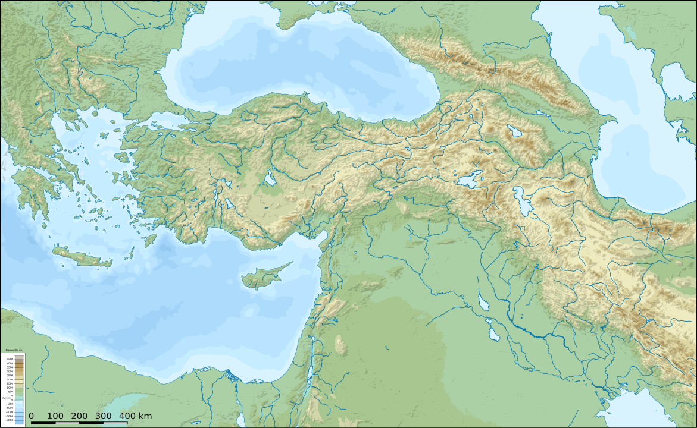

Bitte zusätzlich zum obengenannten Text **diese Podcast-Folge zuhören**. Diesen Überblick habe ich auf basis von neun wissenschaftlichen Artikeln mithilfe vom KI-Werkzeug NotebookLM generiert. Die Artikel sind hier zu finden <https://www.zotero.org/groups/5927975/25judentum/tags/6-Sprachen-kulturelle-Konvergenzen,_podcast/library>. (Mehr [Details](podcasts/1#prompt) dazu, wie diese Podcast-Folge generiert wurde.)

<audio controls>
    <source src='assets/audio/jewish-diaspora-in-antiquity.mp3' type='audio/mp3'>
</audio>

<a href="assets/audio/jewish-diaspora-in-antiquity.mp3" download>⬇️ Podcast-Folge herunterladen</a>

## Aufgabe 

Markiere auf diese Landkarte die (1) Orten, die in der Podcast-Folge zusammen mit jüdischer Diaspora erwähnt werden und (2) welche Sprachen dort von der jüdischen Diaspora verwendet werden.

<a href="../assets/img/mediterranean-middle-east-map.png" download>⬇️ Karte herunterladen</a>

<figcaption>By Rowanwindwhistler at English Wikipedia, CC BY-SA 4.0, https://commons.wikimedia.org/w/index.php?curid=71107156</figcaption>